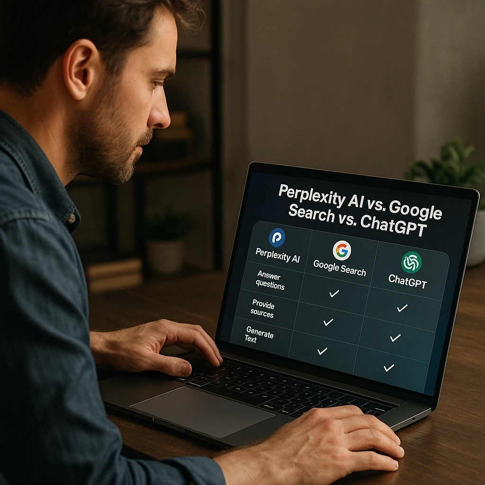

# 什么是Perplexity AI：一个让搜索变得更聪明的工具

---

你是不是也有这样的经历：在Google上搜索一个问题，结果打开了十几个网页，还要自己拼凑答案？或者问ChatGPT，它给你的信息可能已经过时了？

[Perplexity AI](https://pplx.ai/ixkwood69619635) 就是为了解决这个痛点而生的。它不给你一堆链接，而是直接告诉你答案——还带着引用来源，让你知道信息从哪来。2025年5月的数据显示，这个平台已经有超过1500万活跃用户，处理了7.8亿次查询。这些数字说明了什么？说明它确实好用。

---

## Perplexity AI到底是什么

简单说，[Perplexity AI](https://pplx.ai/ixkwood69619635) 是一个会思考的搜索引擎。

你问它一个问题，它会：
1. 理解你在问什么
2. 去网上找相关信息
3. 把找到的内容整理成一个完整的答案
4. 告诉你这些信息来自哪里

这和传统搜索引擎有什么区别？传统搜索引擎给你一堆蓝色链接，让你自己去翻。Perplexity直接把答案摆在你面前，省去了中间那些繁琐的步骤。

这家公司2022年才成立，但发展速度惊人。到2025年，估值已经达到90亿美元。它的核心竞争力在于把大型语言模型和实时网络数据结合起来——既有AI的理解能力，又有搜索引擎的时效性。

## 它是怎么工作的

Perplexity的工作流程其实挺复杂，但用起来很简单：

**第一步：分析你的问题**
AI会拆解你的提问，搞清楚你到底想知道什么。比如你问"量子计算最新进展"，它知道你要的是2025年的最新信息，而不是教科书上的基础知识。

**第二步：搜索网络**
它会实时去网上找相关内容。注意，是实时——不是用几个月前的训练数据糊弄你。

**第三步：整合信息**
从不同来源收集到的信息会被AI处理和组合，形成一个连贯的答案。

**第四步：生成回答**
给你一个完整的答案，每个关键点都标注了来源。

**第五步：验证来源**
所有引用都可以点击查看原文，方便你核实信息的准确性。

### 技术支撑

Perplexity用的AI模型包括：
- GPT-4和GPT-4 Turbo
- Claude 3系列（Opus、Sonnet、Haiku）
- Gemini 2.5 Pro
- Meta的Llama模型
- 自家研发的Sonar模型

这些模型各有特点，Perplexity会根据你的问题选择最合适的那个。

## 它能做什么

### 基础功能（免费版就有）

**实时研究**
想知道今天的新闻？最新的科技进展？Perplexity能给你最新的信息，不是几个月前的旧数据。

**对话式搜索**
你可以像聊天一样提问。问完一个问题，接着问"那这个呢"，它能理解上下文。

**来源引用**
每个答案都标注了信息来源，点击就能看原文。这点特别重要——你不用盲目相信AI说的话。

**多语言支持**
支持多种语言的搜索和回答。

**视觉内容**
不只是文字，还能生成和分析图片。

### 高级功能（Pro版，每月20美元）

**无限搜索**
免费版每天只能用5次Pro搜索，付费版没限制。

**文件上传**
可以上传PDF、图片、文档让AI分析。比如你有一份研究报告，上传后可以直接问它"这份报告的核心结论是什么"。

**高级AI模型**
能用最新最强的GPT-4、Claude等模型。

**Perplexity Labs**
这个功能很有意思——它能把你的研究转化成电子表格、仪表板或应用程序。

**API访问**
开发者可以把Perplexity的功能集成到自己的应用里。

### 2025年的新功能

**语音助手**
iOS应用现在有语音功能了，可以直接说话提问。

**购物助手**
AI帮你搜索产品，还能一键下单。

**Comet浏览器**
一个AI驱动的网络浏览器，目前还在测试阶段。

**WhatsApp集成**
直接在WhatsApp里用Perplexity，不用切换应用。

**增强的Labs**
把研究成果转化成互动应用的功能更强大了。

## 免费还是付费？

Perplexity有免费版，功能已经够用了：
- 无限次快速搜索
- 每天5次Pro搜索
- 基础AI模型
- 标准搜索功能
- 手机和网页都能用

如果你是重度用户，可以考虑Pro版（每月20美元）：
- 无限次快速搜索
- 每天300多次Pro搜索
- 用最强的AI模型
- 上传文件分析
- 用Perplexity Labs
- 优先客户支持

还有Max版（每月200美元）和Enterprise Pro版（每年400美元），适合企业用户。

## 和其他工具比起来怎么样

### vs Google搜索

**Perplexity的优势：**
- 直接给答案，不用你自己翻十几个网页
- 对话式界面，更自然
- 实时整合多个来源
- 没有广告干扰

**Google的优势：**
- 索引的网页更多
- 本地搜索和地图功能强
- 生态系统成熟
- 图片和视频搜索更专业

### vs ChatGPT

**Perplexity的优势：**
- 能访问实时网络
- 有来源引用
- 信息是最新的
- 专门为研究设计

**ChatGPT的优势：**
- 创意写作更强
- 对话记忆更好
- 复杂推理能力更强
- 编程辅助更专业

说白了，如果你要查资料、做研究，用[Perplexity](https://pplx.ai/ixkwood69619635)。如果你要写东西、编程，用ChatGPT。

## 谁做的这个工具

Perplexity AI是2022年由一群AI研究人员创立的：

**Aravind Srinivas**（CEO）：前OpenAI研究员，机器学习专家
**Denis Yarats**（CTO）：前Meta AI研究员，强化学习专家
**Johnny Ho**：前Quora工程师，搜索专家
**Andy Konwinski**：Databricks联合创始人，分布式系统专家

这个团队背景很硬。公司最近一轮融资拿到了5亿美元，估值140亿美元，投资方包括NVIDIA、软银等大公司。

## 适合什么场景

### 学术研究
- 文献综述，自动标注引用
- 追踪最新科研进展
- 交叉验证多个来源
- 事实核查

### 商业分析
- 市场趋势研究
- 竞争对手分析
- 行业报告整理
- 数据收集

### 内容创作
- 文章素材收集
- 事实核查
- 主题探索
- 多角度分析

### 个人学习
- 理解复杂概念
- 追踪时事新闻
- 学习新技能
- 操作指南

## 怎么开始用

**第一步：访问平台**
去perplexity.ai或下载手机应用（iOS/Android都有），免费就能用。

**第二步：试试第一个问题**
别问太宽泛的问题，要具体。比如：
- "2025年量子计算有什么新突破？"
- "可再生能源存储技术怎么工作？"
- "远程工作的利弊是什么？"

**第三步：探索高级功能**
- 用专注模式做针对性搜索
- 试试上传文件分析
- 问后续问题
- 把重要研究保存到收藏集

**第四步：考虑升级**
如果你发现每天5次搜索不够用，或者需要更强的AI模型，Pro版值得考虑。

## 常见问题

**和Google有什么区别？**
Perplexity直接给答案并标注来源，Google给你一堆链接让你自己找。

**答案可靠吗？**
每个答案都有引用来源，你可以点进去核实。但重要信息还是建议多方验证。

**能离线用吗？**
不能，它需要联网实时搜索。

**准确性怎么样？**
取决于它找到的来源质量。一般来说很准确，但关键决策还是要自己核实。

**可以商用吗？**
可以，有专门的企业版。

## 写在最后

[Perplexity AI](https://pplx.ai/ixkwood69619635) 代表了搜索的一个新方向——不是给你一堆链接，而是直接给你答案。它把AI的理解能力和搜索引擎的实时性结合起来，确实解决了很多实际问题。

对于需要经常查资料的人来说——研究人员、学生、内容创作者、商业分析师——这个工具能省不少时间。它不完美，但已经足够好用了。

2025年，随着Comet浏览器和更多新功能的推出，Perplexity会变得更强大。如果你还没试过，不妨去[试试看](https://pplx.ai/ixkwood69619635)。免费版就能满足大部分需求，用着顺手再考虑升级也不迟。
